# PinTabs - Chrome Extension

📌 一款浏览器扩展，帮助你从项目（或工作区）的角度管理标签页。

## 介绍
在使用游览器的时候，我遇到经常困扰我的两个问题：

**找不到一个项目的某个文档**，由于我常常并发在做很多的项目，所以相关文档特别多，这种问题就常常会发生（主要是因为这个原因才让我想开发此插件），当然也可以使用书签来管理，但是书签收藏异常麻烦，我尝试使用之后也放弃了，且书签也少了一些我想要的功能。

**Tab 常年异常混乱，没有找到合适的方法管理**，当然，分组是一个好的方式，但是如果使用分组功能的话，一不小心关掉游览器又会丢失当前项目的文档，且分组的成本又特别高，手动拖拽，命名，过于麻烦。

基于以上两个痛点，我写了一个基于项目维度管理 Tab 的标签管理工具，**📌 PinTabs。**

它的设计思路很像 Arc 游览器的 Space & Project 概念，我在写这个插件的过程中也发现了 Arc 游览器的思路和我这个插件想要解决的问题很像。所以中途也暂停了插件的开发，尝试切到 Arc 游览器上，只是最终遇到的众多 bug 以及卡顿问题让我最终还是放弃使用 Arc 游览器，转而坚定地开发我自己能够顺手管理项目文档的插件。

当然，类似的插件产品还有 Workona 等，但是我感觉略有些重了（而且收费还不便宜），不太符合我的使用习惯。如果 Workona 插件 / Arc 游览器能够很好的适应你工作流的话，我也非常推荐~废话了那么多，介绍一下  PinTabs 吧！

### PinTabs 有什么自己的优势呢？

**亮点功能：**

  - ⭐️ 按照项目的维度管理游览器标签
  - ⭐️ 在打开 Tab 时，可以按照项目的维度自动分组
  - ⭐️ 快速 Pin 当前 Tab 到 Project 中，以及将 Group 的所有 Tab Pin 到 Project 中
  - ⭐️ 快速搜索能力，支持搜索所有项目（Tab 名称/Project 名称/URL）

**其他的一些特性：**

  - 相同的 Tab 被打开后不会再重复打开，会直接跳转到已打开的 Tab
  - 查看 Tab 打开次数，使用数据看板（WIP）
  - Archive 能力，支持 Archive 已完成的项目
  - Gist 数据备份，不用担心数据丢失
  - 游览器被关闭后，不会丢失项目标签数据
  - 支持 Chrome / Edge (理论上支持 Chrome 插件的项目都可以支持)
  - Open source，源码实现也很简单，如果你想的话，可以很方便的定制你自己的功能
  - Raycast 插件搜索（暂未发布）

总的来说，如果你想按照项目维度来管理自己的游览器标签，你就可以尝试使用 PinTabs 来管理自己的标签。

目前 PinTab 我个人已经用了两三个月了，公司内部其他小伙伴也在用，所以可用性应该没什么问题，且有 Gist 备份，所以数据肯定不会丢🥹，有类似痛点的朋友可以尝试一下。

## 使用说明

### 配置快捷键

对于我自己来说，PinTab 是一个日常工作中使用频率极高的插件，所以我会配置快捷键的方式来操作它，你可以参考我的快捷键来进行配置，我将最常用的唤起**插件浮窗**设置为 CMD + E，对我来说非常顺手的快捷键位置。
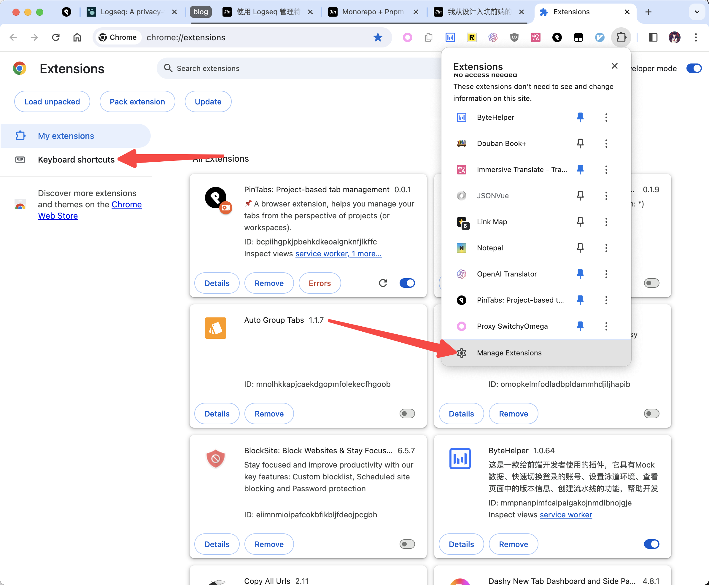
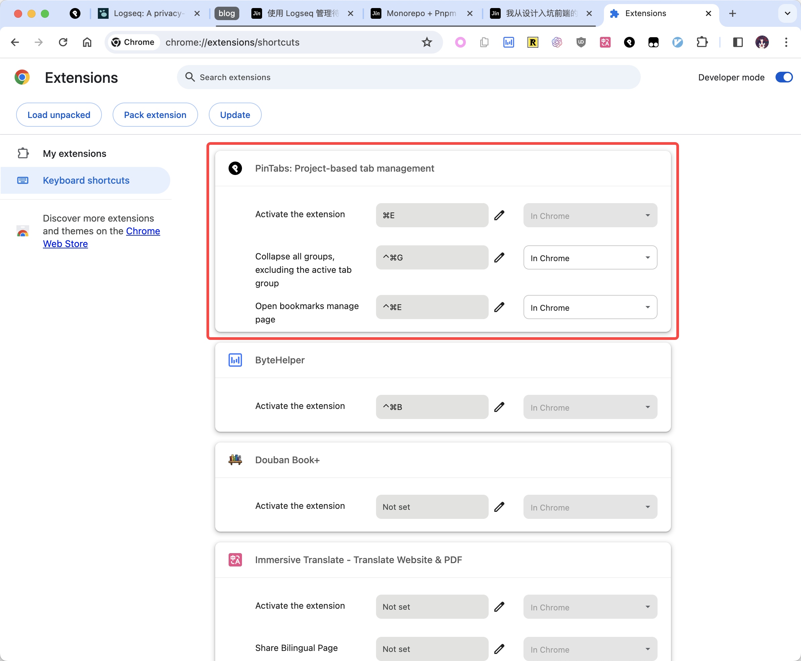

剩下的两个快捷键功能分别为：
折叠所有游览器分组，除了当前 Active 标签所在的分组：这在我们处理多个工作项目时非常好用，避免我们的标签太多，展示不下，具体效果如图所示。
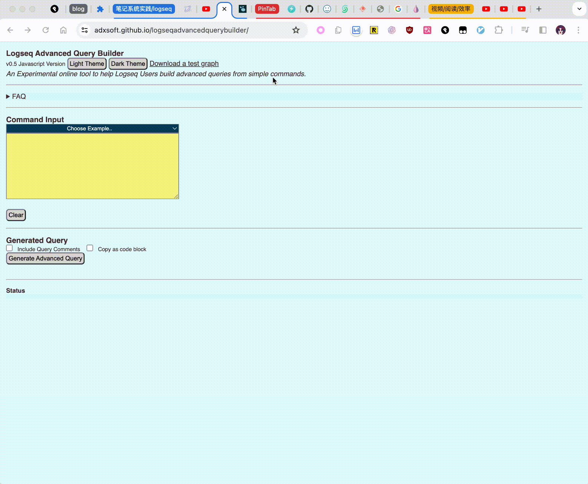

单独打开 PinTab 标签页，让我们可以有更多的空间来显示 PinTab 的内容；

  
你还需要做的是将 PinTab 插件 Pin 到插件栏上，这样在使用快捷键打开时就不会有过度动画导致的延迟。
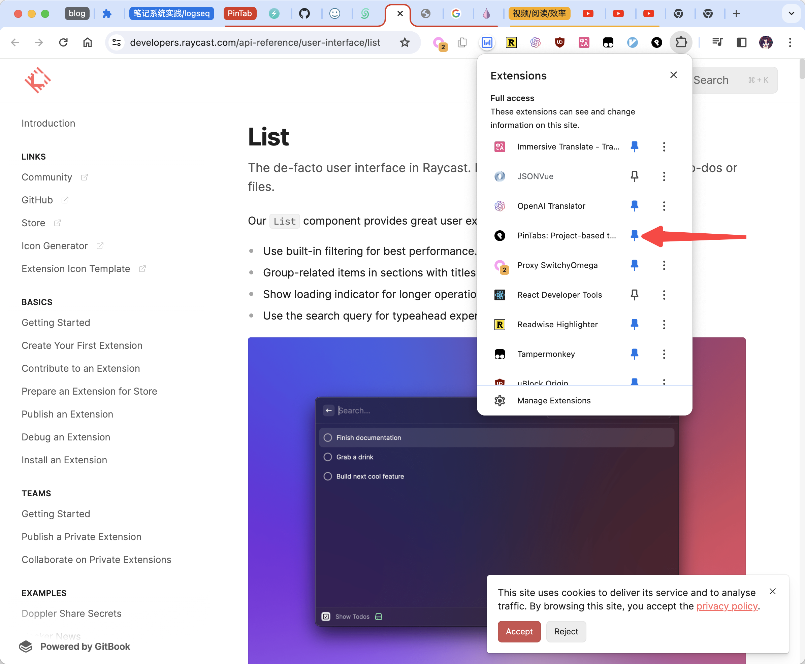

当然，如果你不习惯使用快捷键的话，也可以直接通过图标的方式进行使用。

### 添加 Space / Project

左上角的添加按钮可以用来添加 Space，Space 内的添加按钮则可以增加一个 Project。
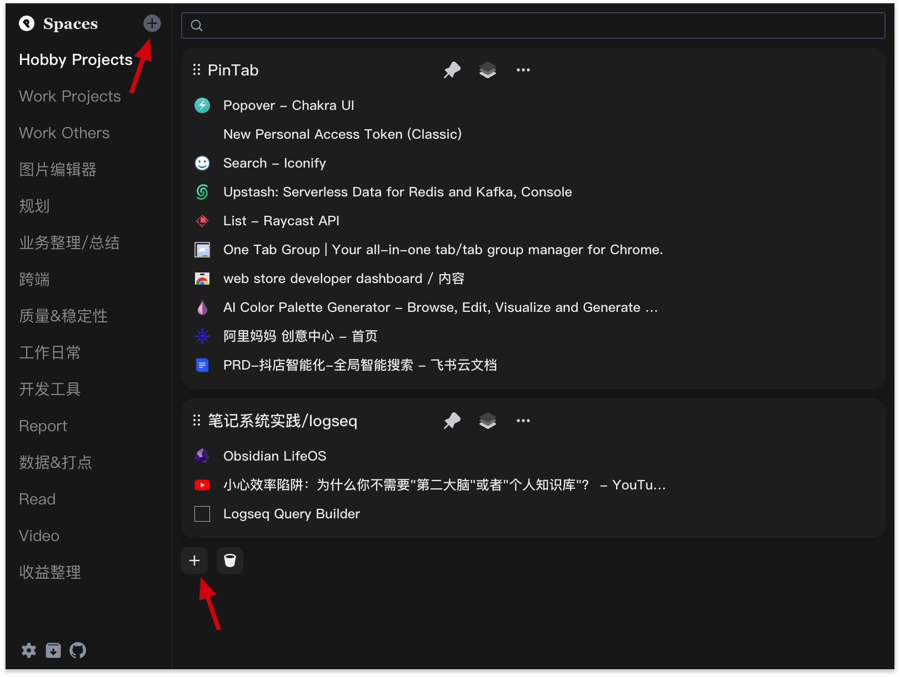

### Pin 标签到 Project 中

当我们完成 Project 添加之后，就可以在 Popup 中快捷的把当前打开的页面 Pin 到 Project 中。

如果单独打开 PinTab 的页面，则有另一种 Pin 的方式，将整个分组标签内容，直接添加到某个 Project 中。

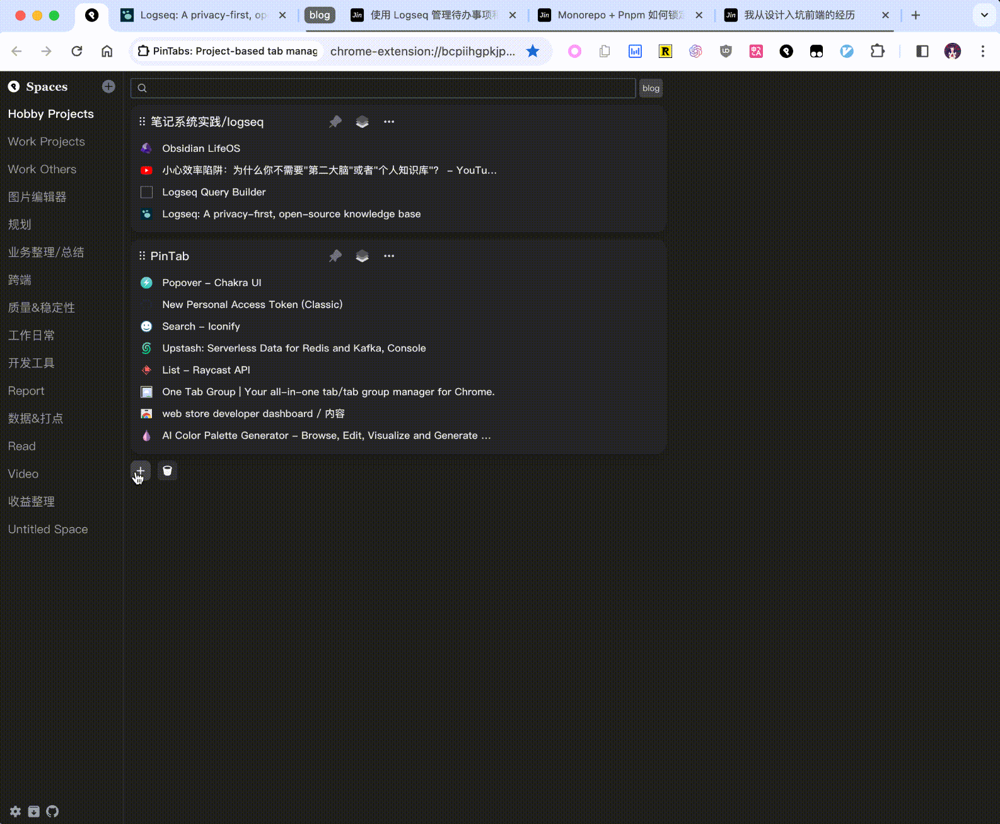

### 调整 Space / Project 位置

通过拖拽 Space / Project 我们可以调整他们的上下位置，以及 Project 所在的 Space。

### 搜索 Tab / Project

当我们的项目越来越多之后，如何快速的找到我想要的项目标签也是非常重要，所以 Pin Tab 支持了搜索功能，可以通过 URL / Project 名称 / 标签名称 来进行搜索，当我们呼出插件弹窗时，会自动聚焦到搜索输入框中，这时直接输入想要找的内容即可。

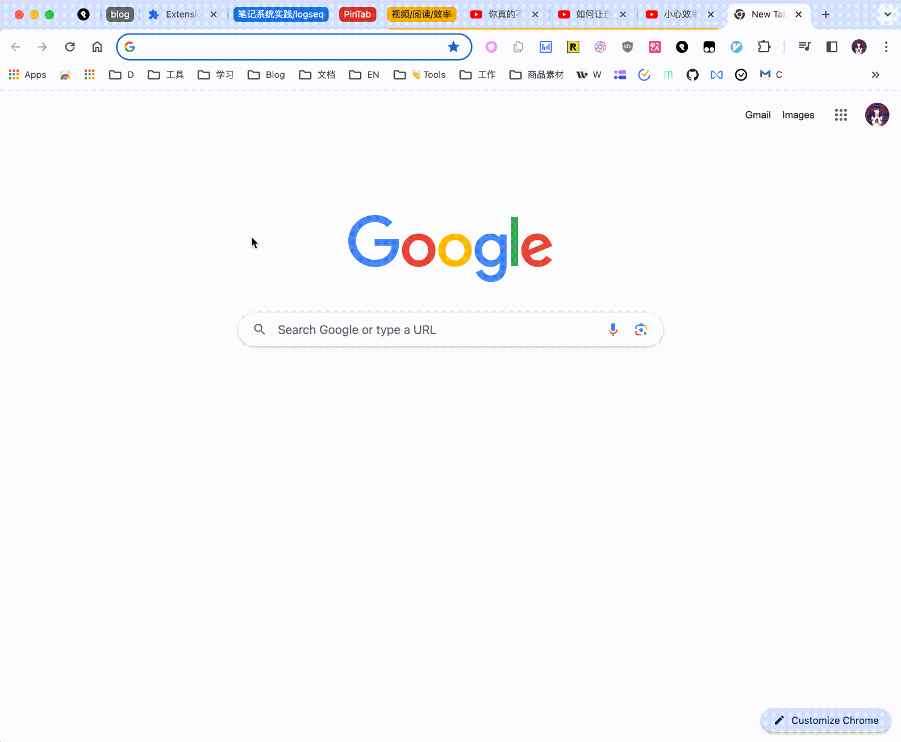

当我们完后搜索后，会很自然的想到使用方向键进行移动，当我们使用上下按键时会 focus 到对应的标签上（同样可以使用 CTRL + N,P 或者 J,K 上下移动）；

在搜索结果也有一些特殊处理，它会根据 Space 内项目被打开的次数来进行排序，一个 Space 项目中标签被打开的次数越多，它在结果页上就会越前置。

## 备份数据 / 多设备同步

由于 PinTab 的数据结构相对复杂，且数据量偏大，所以就无法使用 Chrome 内置的 syncStorage 来进行远端数据存储。我这里则是选择了最简单的 GitHub Gist 方式来备份 + 多设备同步我们的数据，这里需要你创建一个自己的 Gist 空间。

**注册 Gist 私密空间**

首先你肯定需要一个 GitHub 账号，如果还没有的话，可以自行搜索如何创建。

https://gist.github.com 进入此页面，随便填一些东西之后，创建 Gist 空间即可。
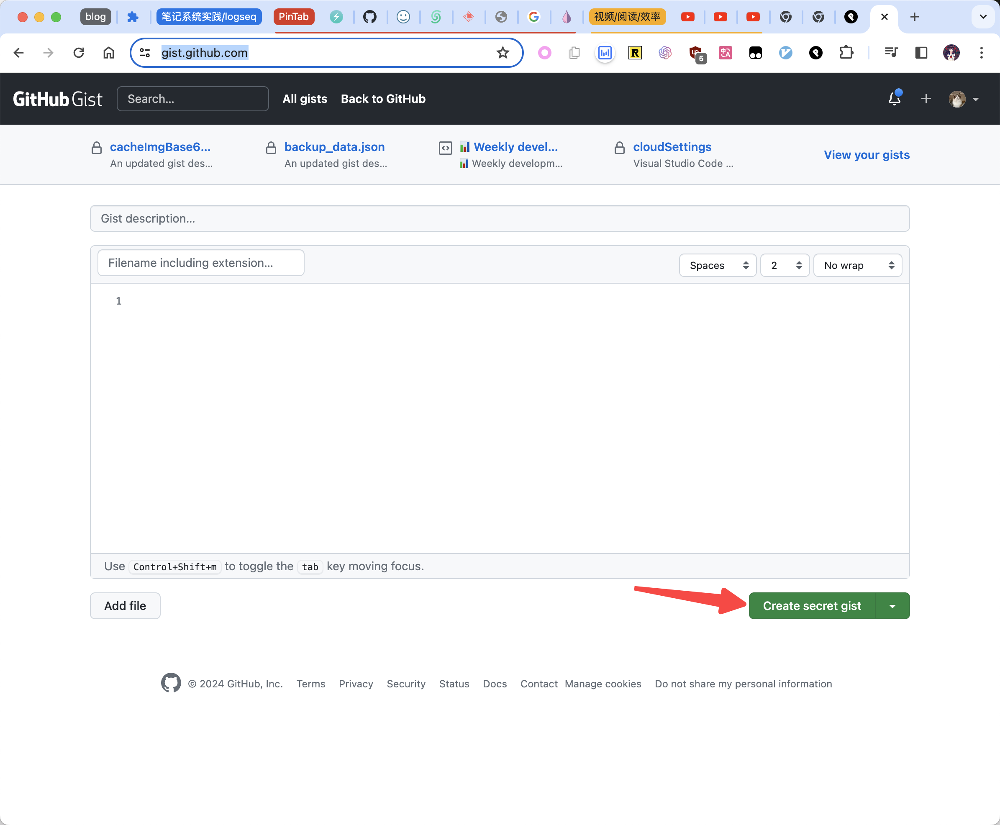
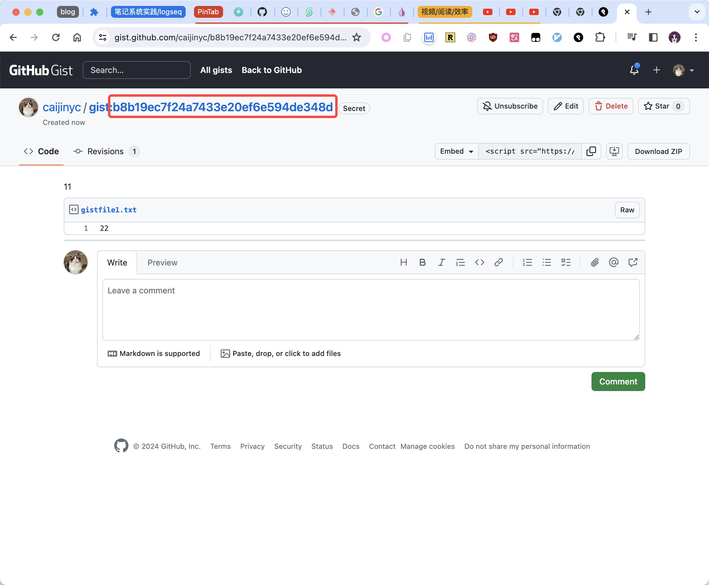
这样你就获得了你的 Gist ID。

**生成 Gist 操作 Token**

由于是你自己的个人 Gist，所以需要配置 Token 来给插件权限更新 Gist 数据，这里只需要选中 Gist 权限就可以了。

https://github.com/settings/tokens/new
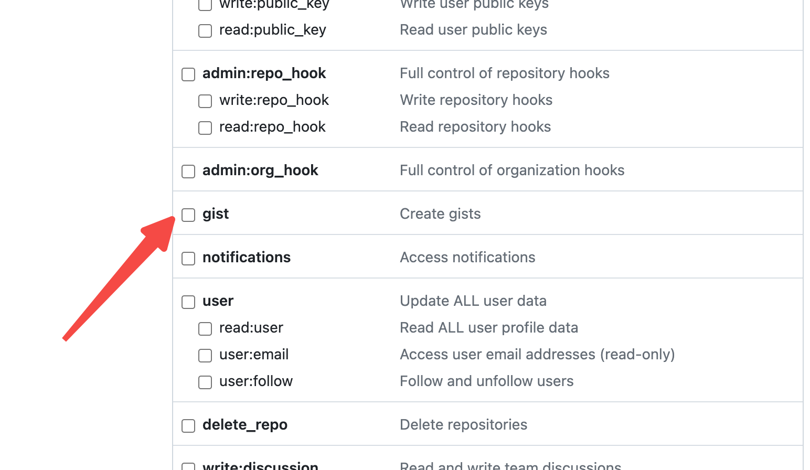{:height 322, :width 554}
完成之后就可以获得你的 Gist 更新权限的 Token。

**配置相关信息：**

打开 Options 页面，将 GitHub 的 Username, Gist ID Gist Token 填写进行即可完成同步配置，配置完成之后在 PinTab 中就会展示 GitHub 的 Logo，点击就可以跳转到自己的 Gist 空间查看备份数据。

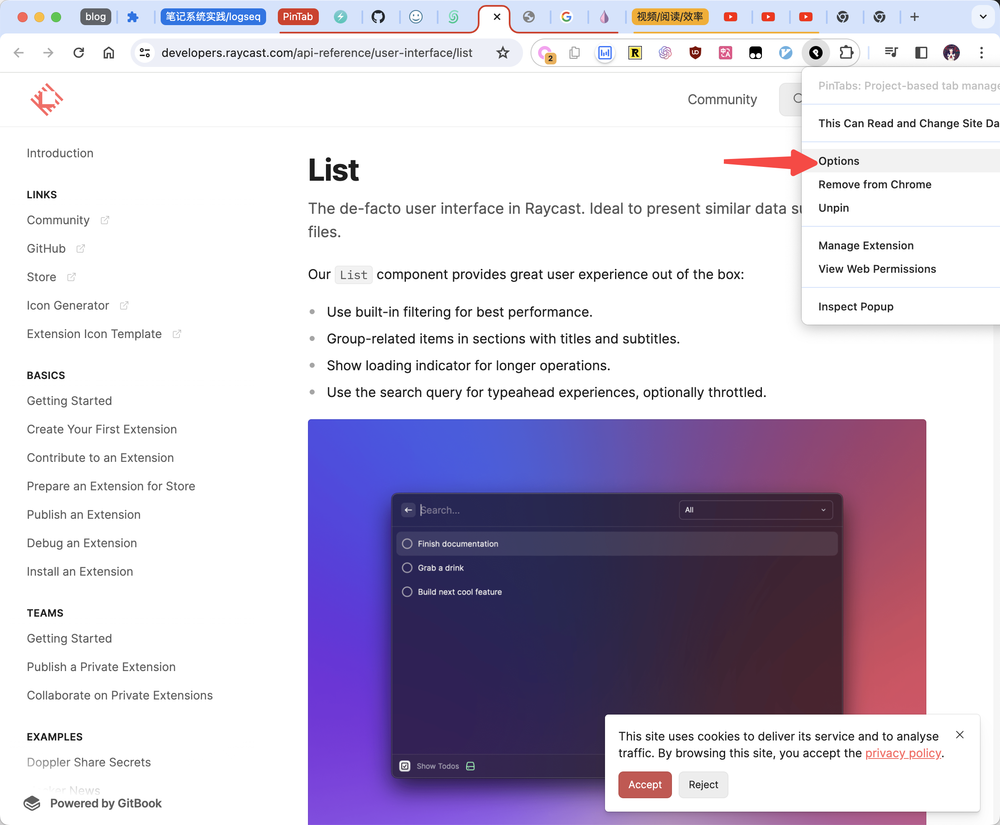
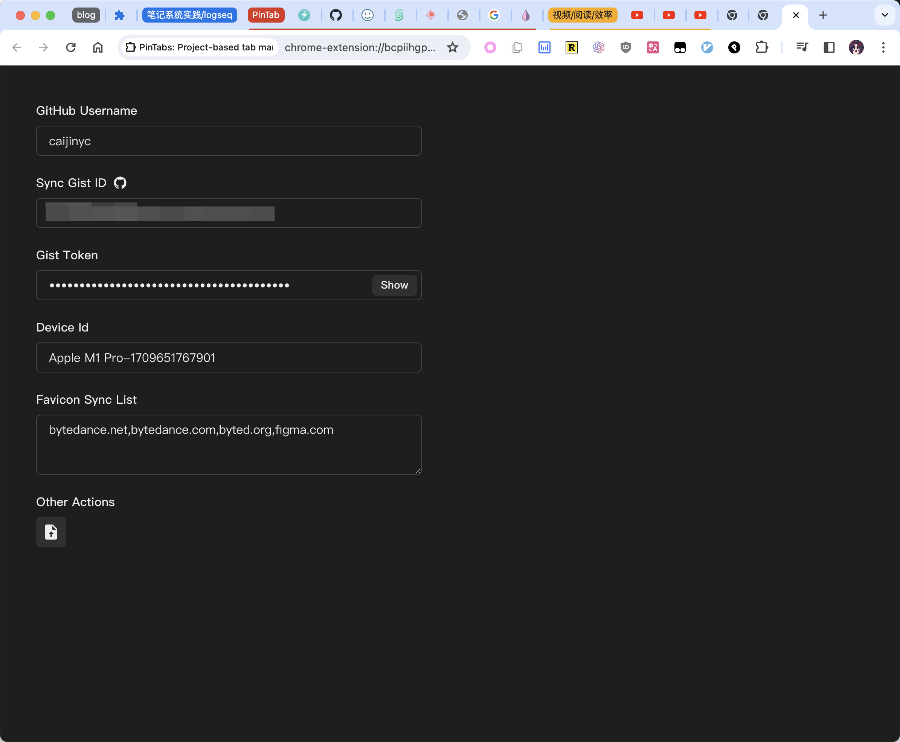

## Thanks To

[chrome-extension-boilerplate-react-vite](https://github.com/Jonghakseo/chrome-extension-boilerplate-react-vite)
